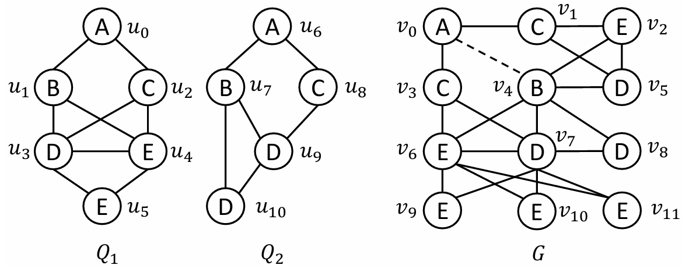

# Cimos

Cimos is a framework for **C**ost-effective **i**ndex-based **m**ulti-query **o**riented continuous **s**ubgraph matching.  

## Build Cimos

Cimos needs C++ support only.

- C++ 17 support (gcc $\geq$ 9.0).
- Linux system.
- CMake $\geq$ 3.13.1.

Clone Cimos and install necessary dependencies first with following commands.

```
$ git clone https://github.com/CrankyLover/Cimos.git
$ cd Cimos
$ make
```

## Run Aquila
The following command can be executed to run Aquila.
```
$ build/csm -q <query_folder_path> -d <data_graph_file_path> -u <update_stream_file_path>
```

-  `query_folder_path` represents the query folder path, which contains a list of query graph files. In a specific query graph file, each line represents a vertex with `v vertex_id vertex_label` or an edge with `e source_vertex_id target_vertex_id`, e.g.
```
v 0 1
v 1 3
v 2 5
e 0 1
e 1 2
e 0 2
```
- `data_graph_file_path` represents the data graph, with each line represents a vertex or an edge, which is the same as the query graph.

- `update_file_path` represents the update stream, each line represents an updated vertex with `v vertex_id vertex_label` or an updated edge with `e source_vertex_id target_vertex_id`, e.g.
```
v 3 4
e 3 2
-e 1 2
```

## Toy Example

The files under `example/Q` shows example querygraphs $Q_1$ and $Q_2$, `example/D.txt` shows the example data graph, `example/U.txt` shows the update graph. **This example is the same as the example used throughout our paper.**

An example to run Cimos is shown below:
```
$ ./csm -q querygraphs -d datagraph.txt -u updatestream.txt
```

The example data graph and query graphs are shown below, noting that we make mapping which maps uppercase letters of the label to Arabic numerals, which can be verified in the files in `example`.



## Benchmark

The LSQB-QG workloads we used can be found in another repo [LSQB-QG](https://github.com/CrankyLover/LSQB-QG).


